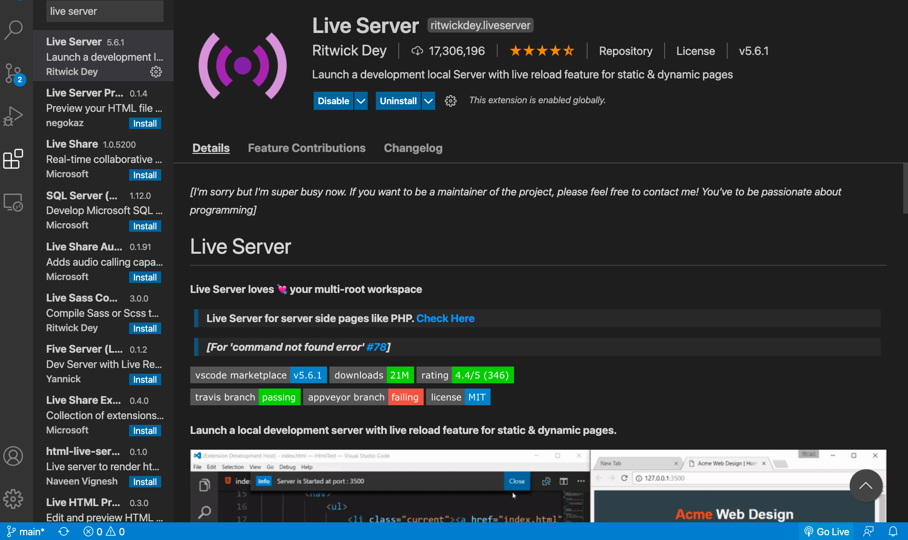

# gomoku-ai
An implementation of AI for gomoku using Monte Carlo Search Tree.  
UI was developed using Vue.js

<h1 style="margin-top: 30px">Usage</h1>
<ul>
    <li>Clone the repository and open index.html</li>
    <li>This project can also run on the server. Download and enable live server on VS Code. Then open the cloned repository and click "Go Live" on the bottom right corner to run on a local host.
    </li>
    
</ul>

